# Tutorial u2vis

## Setup

To use u2vis, you simply have to import the u2vis files and add the u2visSystemController-prefab to your scene and you are ready to go.

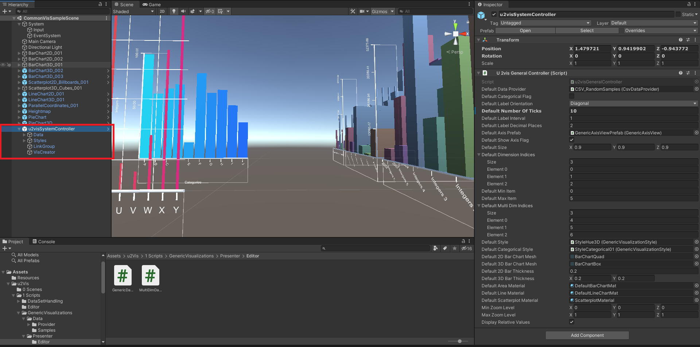

## General Structure of an Visualization

A u2vis visualization 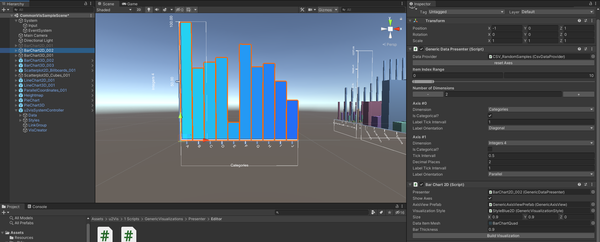has two main script components. The DataPresenter and the VisualizationView 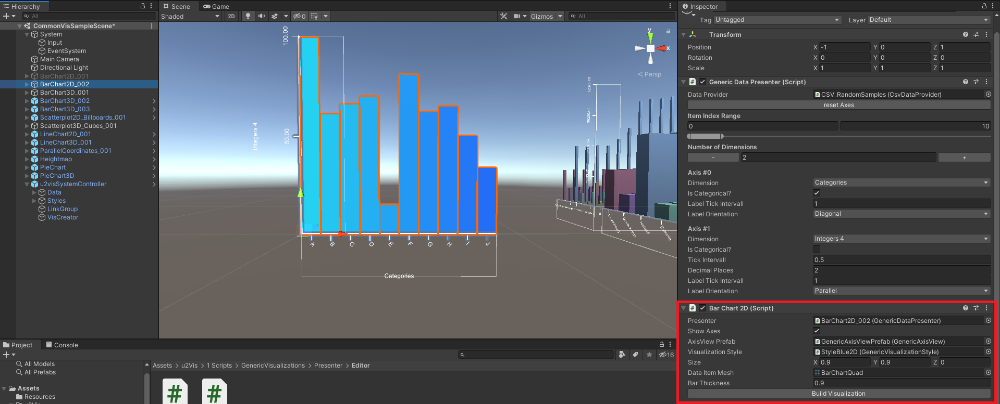 which are used to define and produce a visualization. Additionally the DataPresenter needs a DataProvider  which manages the underlying data. The DataPresenter is used to define which Data from the source (DataProvider) are used and how the Axis should look like. The Visualization script itself uses this information to create the needed Axes and DataMeshes for the visualization. Visualizations, which are correctly created with the u2visSystemController additionally will have a wrapper attached. 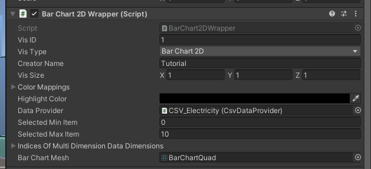

This wrapper holds additional information like the id and the creator name, as well as some redundant information from the creation process. As of now an in editor update of visualizations created with the system controller is not supported. We advice the user to create a new visualization instead. 

## The System Controller

### General Structure

The u2visSystemController-GameObject has the appropriate script, the u2visGeneralController attached. 

The fields of this system controller store the default values for the visualization creation from code as well as from the editor. If you whish to change them, you can do that here. The system controller stores all visualizations correctly created with it and manages the creations as well as the basic id system. As it is a Singleton, it only is in the application once.

The System controller GameObject has 4 attached. 3 of those hold examples an defaults, the 4th is for the in Editor creation. 

The first GameObject (Data) holds a number of example DataProviders, one of those is the "factory default".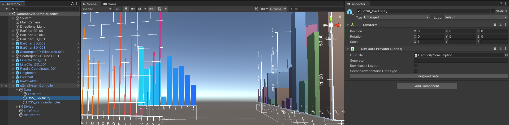

These DataProviders can be used as the source for data in the creation process, alternatively you can create your own data providers or change the source files of the given ones. You can then later attach those to your custom scripts for the in code creation or you can link them in the in editor creation.

The second child GameObject holds some example styles. These you can either use, edit or create your own after this. The styles are used to define the color scheme of the visualization. 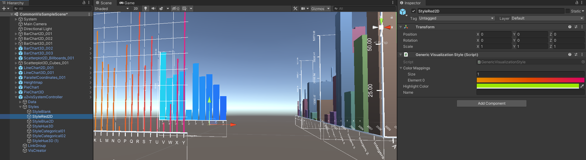

The 3rd Child is an example/default Linking group, needed for brushing and linking.

### Creating Visualizations inside the Editor

The 4th child object of the system controller is used to create visualizations from within the editor.

To Create a visualization, you select this child in the scene hierarchy on the left, and use the provided component on the right. 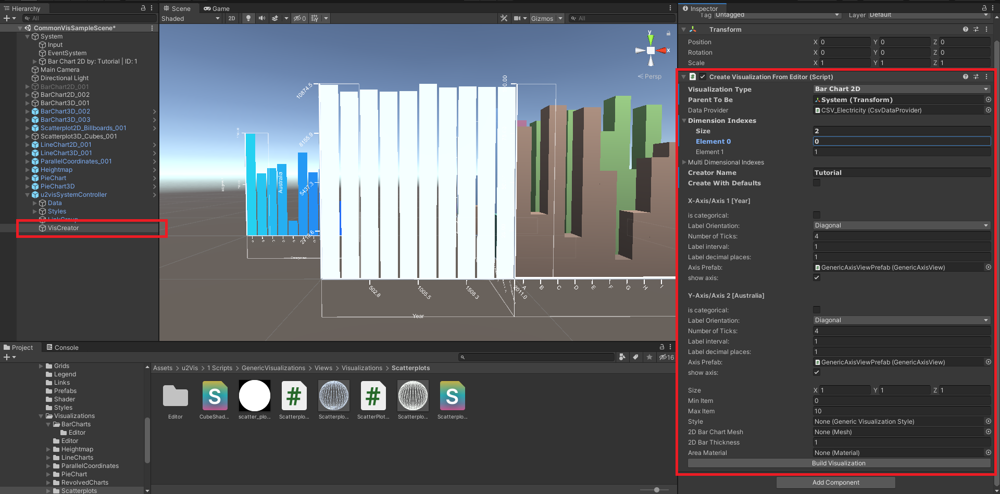Here you can select a visualization type, the parent, where the visualization should be spawned, the data provider which provides the source data. You then choose which dimensions you want to use, by entering those in the Dimension indices list. 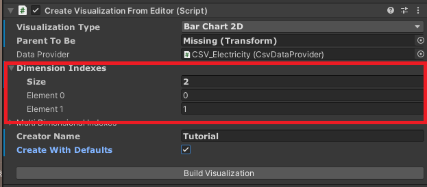 

For Visualizations, which support it, you can then also chose multidimensional indices. 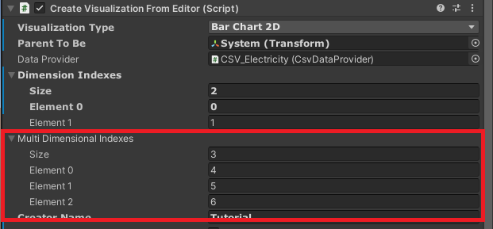

This is useful for 3DBarCharts or 3DLineCharts. You have to enter a creator name afterwards and if you want to spawn the visualization with the defaults from the u2visGeneralController, you mark the tick box. Then you can press Build Visualization and you will have one created. 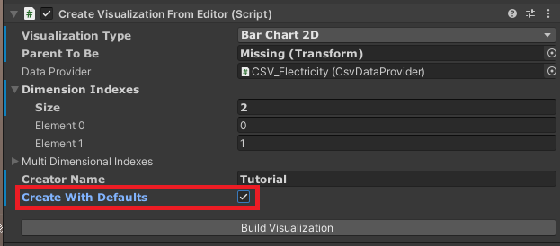

If the amount of given dimension indices does not match the visualization type, an error will appear and you will have to change your settings accordingly. 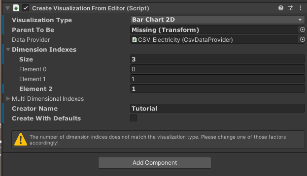

If you don't want to use the default settings, you untick the defaults box and will be presented with the settings for the different axes and additional general settings. These might change for different visualizations, as some need more information than others. 

The different axes will be named after their function and their dimension name and have have the following settings:

IsCategorical --> flag to describe if the information on this axis are categorical (non-continuous, like names or years).

LabelOrientation --> the orientation of the tick labels.

NumberOfTicks --> the amount of ticks the axis should have.

LabelInterval --> int value which describes every nth tick has an label (1=every tick, 2=every second tick etc.).

DecimalPlacesOfLabels --> the decimal places of the tick labels, if they are numeric.

AxisPrefab --> The prefab of the axis. We have made a prefab which produces the axis of the examples. If you want to change the look of the axis, produce a prefab like our example.

ShowAxis --> flag if the axis should be shown.

Here is an example of set options and its resulting visualization:

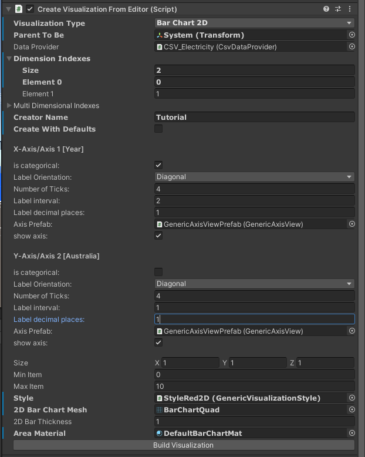

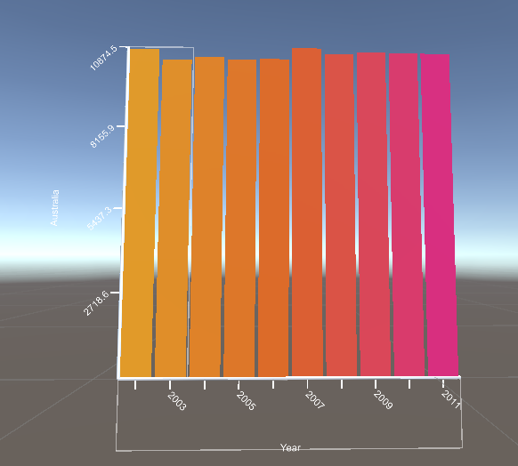

If some references to components or game objects are not set, the default settings will be used. This means if you for example don't fill the style field, the visualization will spawn with the default style. This does not count for numbers, enum selections or tick boxes, because these always have a starting value. If you do not change this value, it will stay.

### Creating Visualizations from Code

To create a Visualization you have to call the `CreateVis` function. In needs a type of GeneralVisualizationWrapper, which defines the type of visualization. For Example to create a 2D bar chart you would use `CreateVis<BarChart2DWrapper>`.

`public T CreateVis<T>(AbstractDataProvider dataProvider, int[] dimIndices, Transform parent, string creatorName) where T: GeneralVisualizationWrapper`

The function returns an object of the wrapper type you have given it. Depending on the visualization you might need to set values specific for this type of visualization afterwards. This is done by calling the `Set[VisualizationType]Values()`
method on the returned wrapper object. In the 2DBarChart example this would be the `SetBarChart2DValues()` method.

Afterwards  the `Initialize()` method or the `InitializeWithDefaults()` method has to be called on the wrapper. The `Initialize()` method sets the values manually, while the `InitializeWithDefaults()` method uses the values set in the u2visGeneralController.

The values needed for the initialize method are mostly self explanatory. You set the size and the item range via size and min/maxItem. You can give the visualization either a style as described before or define a base and a highlight color. These are exclusive to each other. The last part are the axes information. The information is given via an array from AxisInformationStructs. the first element of the array describes the X-, the second element the Y- and the third element the Z-Axis. Additional elements can be used to describe additional Axes, for example for parallel coordinates visualizations. 

The AxisInformationStruct holds the Information for one axis and contains the properties:

IsCategorical --> flag to describe if the information on this axis are categorical (non-continuous, like names or years).

ShowAxis --> flag if the axis should be shown.

AxisPrefab --> The prefab of the axis. We have made a prefab which produces the axis of the examples. If you want to change the look of the axis, produce a prefab like our example.

NumberOfTicks --> the amount of ticks the axis should have.

LabelInterval --> int value which describes every nth tick has an label (1=every tick, 2=every second tick etc.).

LabelOrientation --> the orientation of the tick labels.

DecimalPlacesOfLabels --> the decimal places of the tick labels, if they are numeric.


You will need to create one AxisInformationStruct per used axis. Otherwise the default is taken. You can later change the axis information by using the `SetAxisValuesByAxisIndex()` method from the wrapper.

After you created the vis, set special values and initialized it, you will have your visualization ready. Its wrapper will additionally be accessible in the Visualizations() dict in the u2visGeneralController via the id as a key. If you delete an visualization, please make sure, that you remove it from the dictionary via `RemoveVisById()`.

Example Code to create a BarChart:

```c#
BarChart2DWrapper wrapper = _controller.CreateVis<BarChart2DWrapper>(dataProvider, dimensionIndexes[], parentToBe, creatorName);
                
wrapper.SetBarChart2DValues(0.9f /** barThickness **/, barChart2DMesh /** The base mesh used for the Bars. You can usually use the default from the u2visGeneralController.**/);
wrapper.Initialize(
    size: size, 
    selectedMinItem: minItem,
    selectedMaxItem: maxItem,
    axisInformation: axisInformationStructs[], /** the array of the AxisInformationStructs as described before.**/
    style: style
);
```
If you want, you can afterwards add interaction to the visualization. You can attach a component to the GameObject of the Type `BaseVisualizationInteraction` and its derived classes. We already implemented an Interaction for BarCharts and scatterplots. To add interaction to the BarChart from before, you can do that like below:

```c#
BarChart2D_Interaction interaction = wrapper.gameObject.AddComponent<BarChart2D_Interaction>();
interaction.Initialize(wrapper.GetComponent<GenericDataPresenter>(), wrapper.GetComponent<BaseVisualizationView>());
```

​            

## Brushing and Linking

For brushing and linking a visualization needs an interaction component, so it can be highlighted/brushed. To link highlightable visualizations together, you need a LinkingGroup component. This component holds a list of linked presenters of the visualizations. This list can either be edited via the inspector in the editor or via code and the provided methods `LinkGroup.Add()` and `LinkGroup.Remove()` . You can get the presenters of the visualizations if you know the id from the Visualizations dict of the u2visGeneralController. Here the usage of groups also might be useful. 

Visualizations linked in the described way will highlight the same data items across the visualizations, while you only need to interact with one visualization of the group.

## Expanding with new visualization types

To create a new Visualization Type you will have to produce 2 new classes (if you also want interaction: 3).

One class is the the VisualizationView. It needs to be derived from BaseVisualizationView. You will then have to implement and override methods as needed to create a new visualization based on the information given to you by an GenericDataPresenter or a derived class.

The other class you will need to implement is the Wrapper object. This will allow for compatibility with the u2visGeneralController and easier access to certain information. The Wrapper has to be derived from the GeneralVisualizationWrapper and implement the abstract methods. If needed, other methods could be overridden. 

The creation of this kind of new visualization should then still work like described above. You will of course give the CreateVis<>() function your new wrapper. `CreateVis<YourNewWrapper>()`

To allow for interaction you will have to additionally implement an interaction class derived from BaseVisualizationInteraction. This component has to be attached to new visualizations of your new type.

To allow for in editor creation you will have to add your visualization to the `u2visGeneralController.VisType` enum. You will then need to edit the creator script `CreateVisualizationFromEditor`  to add your new case into the switch cases. Additionally you might want to edit the `CreateVisualizationFromEditorEditor` script, to show/hide fields according to your needs`and add fields that might not already be there.

## Additional Notes

Some shaders only work after starting the editor play mode once. The CubeShader for the scatterplot will have correctly oriented cubes after that and the bar charts will only occlude the text which is actually behind them after a play mode cycle.

Additionally the u2visGeneralController does provide rudimentary grouping functionality, which you can find in the source code.

## 
